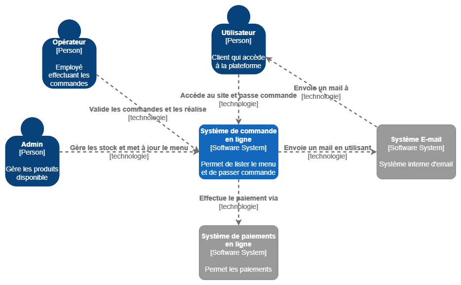
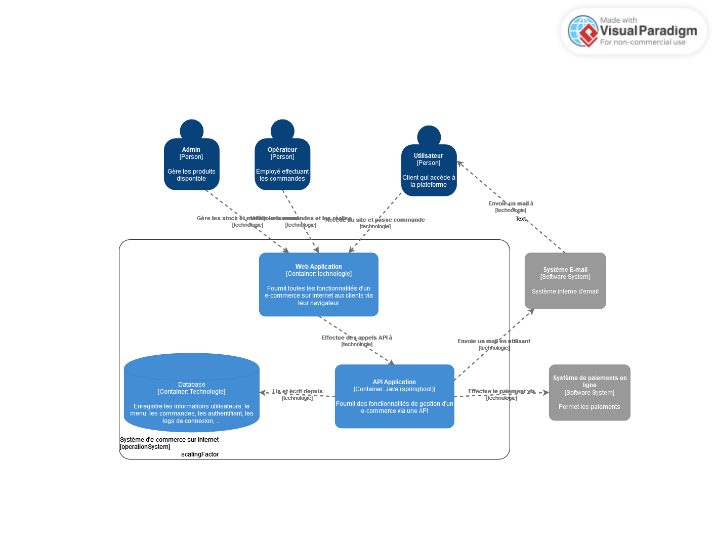
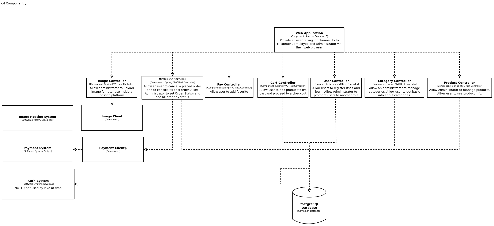
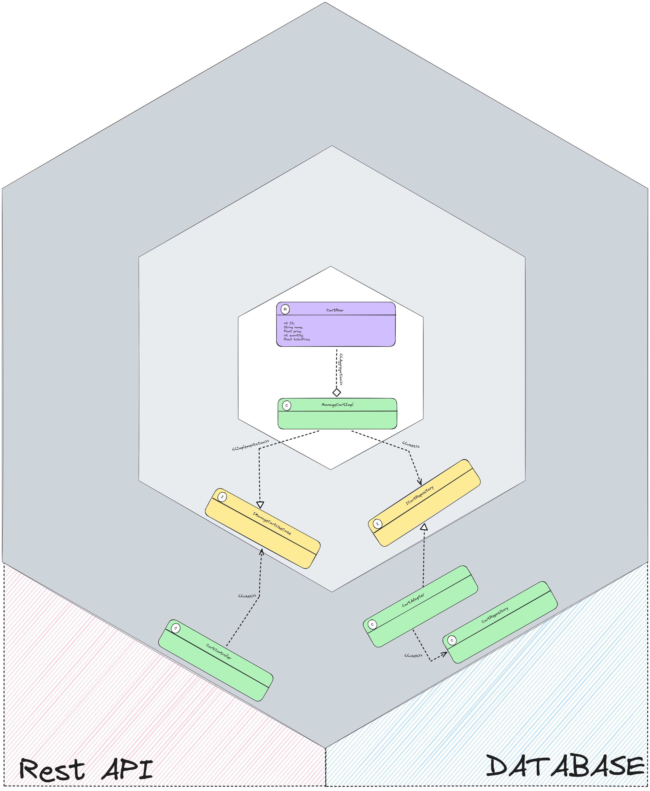
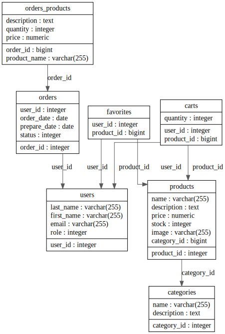

# [HEH Gourmet](https://github.com/MA-Visty/HEH_Gourmet)

## Présentation
Dans le cadre de ce projet, après avoir identifié des inefficiences dans le système de commande de
repas à la HEH, nous avons décidé de créer un site de commande en ligne. Ce site permettra aux
utilisateurs d'accéder au menu proposé, de passer des commandes, de personnalisées et de payer la
commande. Les utilisateurs auront également la possibilité de créer un compte client, facilitant la
répétition de commandes quotidiennes, l’accès à l’historique des commandes et d’avoir des
réductions ou offres de fidélité proposées par le gérant. Du côté du gérant, le site lui permettra de
modifier le menu, d'accéder à la liste des commandes et d’annuler des commandes en cas de
manque de produits, entraînant ainsi un remboursement.

## Détails du Projet
### Analyse
Ci-dessous , vous retrouverez les différents schema realisé dans le cadre de la réalisation de ce projet.

#### MOCKUP : mockup initial pré-developpement

#### C4 : System Context diagram

#### C4 : Container diagram

#### C4 : Component diagram

#### UML : Architecture hexagonale

#### ERD : DATABASE DIAGRAM

### Fonctionnalité
#### Utilisateurs
##### Tous les utilisateurs
- lister les produits disponibles
- suivis de l'état de la commande
- payement via ~~PayPal~~ Stripe
- ~~possibilité d'annuler une commande X h avant quel soit préparée~~

##### Utilisateurs connectées
- connection ~~avec possibilité de multifacteur~~
- commande avec compte permettant plus de fonctionnalité telle que des point de fidélité etc.
- ~~commande récurrente~~
- ~~point de fidélité~~
- panier lié au compte

##### ~~Utilisateurs déconnectées~~
- ~~commande sans compte requirent uniquement une adresse email. un mail avec le numéro de commande sera donc envoyé par mails une fois la transaction effectuée.~~
- ~~panier stocké dans les cookies du navigateur~~

#### Opérateur
- ~~connection multifacteur obligatoire~~
- permets de voir la liste des commandes à préparer 
- possibilité d'annuler une commande avec un remboursement automatique en cas de problème ( manque de produit, etc.)
- validation d'une commande ( la commande a bien été délivrée )
- ~~permets de configurer le nombre de produits disponibles~~

#### Administrateurs
- ~~connection multifacteur obligatoire~~
- possibilité de gérer les produits ( ajouter, retirer, éditer)
- possibilité de gérer les commandes ~~( ajouter, retirer, éditer)~~ ( changer le status )

### Technologie
#### En Front End :
- React
- ~~Tailwind CSS~~ Bootstrap 5

#### En Back End :
- SPRING boot ( + jakarta + lombok )

### Problèmes 🤡️ et solutions 😎️
Certaine divergence d'opinions nous a posé des problémes d'organisation. 

#### Frontend
Manque de temps et de communication mais réussi à dévelloper un ensemble de fonctionnalité en s'organisant.

#### Backend
Probléme divers lors des migrations , vision trop grande ( un trop grands nombres de fonctionnalités ont été prévues ). Mais , malgrés ces problemes le backend implemente un nombre important de fonctionnalité comparé au nombre minimum requis.

### Conclusion
Ce projet nous à permit de concrétiser l'ensemble des concepts apris aux cours.
Malheureusement, par manque de temps, nous n'avons pas pu implémenter l'ensemble des taches décrite dans ce rapport mais avons su frounir un travail suffisant qui nous plait 😁️.
